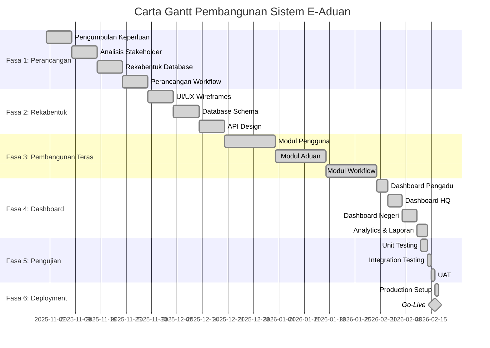
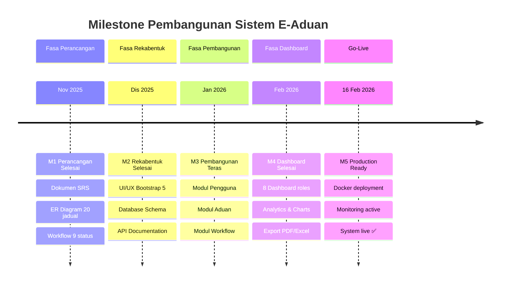
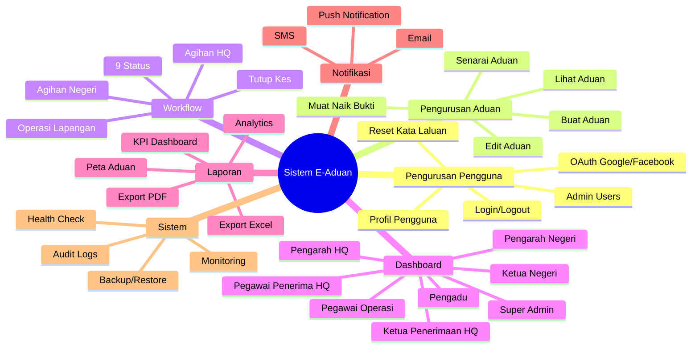

# 📋 CARTA PERBATUAN PEMBANGUNAN SISTEM E-ADUAN
## Jabatan Imigresen Malaysia - Immigration Complaint Management System (ICMS)

**Versi Dokumen:** 1.0  
**Tarikh Kemaskini:** 17 Mac 2026  
**Nama Projek:** Sistem E-Aduan PATI v3.0  
**Jangkaan Siap:** 16 Februari 2026 ✅

---

## 📑 KANDUNGAN

1. [Pengenalan Projek](#1-pengenalan-projek)
2. [Fasa Pembangunan](#2-fasa-pembangunan)
3. [Carta Gantt](#3-carta-gantt)
4. [Milestone (Perbatuan)](#4-milestone-perbatuan)
5. [Sumber Manusia & Tanggungjawab](#5-sumber-manusia--tanggungjawab)
6. [Modul & Komponen](#6-modul--komponen)
7. [Risiko & Mitigasi](#7-risiko--mitigasi)
8. [Status Projek](#8-status-projek)

---

## 1. PENGENALAN PROJEK

### 1.1 Latar Belakang
Sistem E-Aduan adalah platform digital untuk menguruskan aduan berkaitan **PATI (Pendatang Asing Tanpa Izin)** yang melibatkan:
- 16 Negeri seluruh Malaysia
- 9 Peranan pengguna (roles)
- 9 Peringkat workflow
- 20+ jadual pangkalan data
- 100+ fail PHP

### 1.2 Objektif Projek
| # | Objektif | Status |
|---|----------|--------|
| 1 | Mewujudkan platform aduan PATI berpusat | ✅ Tercapai |
| 2 | Mengautomasikan proses workflow aduan | ✅ Tercapai |
| 3 | Menyediakan dashboard pelbagai peranan | ✅ Tercapai |
| 4 | GPS tracking untuk operasi lapangan | ✅ Tercapai |
| 5 | Sistem notifikasi automatik | ✅ Tercapai |
| 6 | Audit trail lengkap | ✅ Tercapai |

### 1.3 Skop Projek
- **Dalam Skop:** Pengurusan aduan, workflow, laporan, notifikasi, analytics
- **Luar Skop:** Integrasi sistem legasi JIM, mobile app native

---

## 2. FASA PEMBANGUNAN

### Fasa 1: Perancangan & Analisis (4 Minggu)
```
Tempoh: 1 November 2025 - 28 November 2025
```

| Minggu | Aktiviti | Output |
|--------|----------|--------|
| 1 | Pengumpulan keperluan (Requirements Gathering) | Dokumen SRS |
| 2 | Analisis stakeholder & use cases | Use Case Diagram |
| 3 | Rekabentuk pangkalan data | ER Diagram |
| 4 | Perancangan workflow & seni bina sistem | System Architecture |

**Deliverables:**
- [ ] ✅ Dokumen Spesifikasi Keperluan Sistem (SRS)
- [ ] ✅ ER Diagram (20 jadual)
- [ ] ✅ Workflow Diagram (9 status)
- [ ] ✅ Perancangan Projek (Project Plan)

---

### Fasa 2: Rekabentuk Sistem (3 Minggu)
```
Tempoh: 29 November 2025 - 19 Disember 2025
```

| Minggu | Aktiviti | Output |
|--------|----------|--------|
| 5 | Rekabentuk UI/UX wireframes | Mockups |
| 6 | Rekabentuk database schema | SQL Scripts |
| 7 | Rekabentuk API endpoints | API Spec |

**Deliverables:**
- [ ] ✅ UI/UX Design (Bootstrap 5)
- [ ] ✅ Database Schema dengan indexes
- [ ] ✅ API Documentation
- [ ] ✅ Security Design (OAuth, hashing)

---

### Fasa 3: Pembangunan Modul Teras (6 Minggu)
```
Tempoh: 20 Disember 2025 - 30 Januari 2026
```

| Minggu | Aktiviti | Status |
|--------|----------|--------|
| 8-9 | Modul Pengguna (Authentication) | ✅ Selesai |
| 10-11 | Modul Aduan (Core Complaint) | ✅ Selesai |
| 12-13 | Modul Workflow (Status Management) | ✅ Selesai |

**Komponen Dibangunkan:**

#### Modul Pengguna (Minggu 8-9)
```
├── login.php / logout.php
├── register.php / process_register.php
├── lupa_kata_laluan.php
├── google_oauth.php / facebook_oauth.php
├── profil_pengadu.php
└── admin/manage_users.php
```

#### Modul Aduan (Minggu 10-11)
```
├── buat_aduan.php / process_aduan.php
├── senarai_aduan.php / lihat_aduan.php
├── edit_aduan.php / kemaskini_aduan.php
├── check_aduan.php
└── api_check_duplicate.php
```

#### Modul Workflow (Minggu 12-13)
```
├── admin/semakan_aduan.php
├── admin/agihan_aduan.php
├── admin/process_terima_aduan.php
├── admin/process_forward_*.php
├── admin/process_assign_*.php
└── admin/process_tutup_aduan.php
```

---

### Fasa 4: Pembangunan Dashboard & Laporan (4 Minggu)
```
Tempoh: 31 Januari 2026 - 11 Februari 2026
```

| Minggu | Aktiviti | Status |
|--------|----------|--------|
| 14 | Dashboard Pengadu | ✅ Selesai |
| 15 | Dashboard HQ (3 roles) | ✅ Selesai |
| 16 | Dashboard Negeri (3 roles) | ✅ Selesai |
| 17 | Analytics & Laporan | ✅ Selesai |

**Dashboard Dibangunkan:**
```
├── dashboard_pengadu.php
├── admin/dashboard_pegawai_penerima.php
├── admin/dashboard_ketua_penerimaan_hq.php
├── admin/dashboard_pengarah_hq.php
├── admin/dashboard_ketua_negeri.php
├── admin/dashboard_pengarah_negeri.php
├── admin/dashboard_pegawai_operasi.php
├── admin/dashboard_superadmin.php
└── admin/analytics.php
```

---

### Fasa 5: Integrasi & Pengujian (2 Minggu)
```
Tempoh: 12 Februari 2026 - 15 Februari 2026
```

| Aktiviti | Tool/Kaedah | Status |
|----------|------------|--------|
| Unit Testing | Manual + tests/system_tests.php | ✅ Pass |
| Integration Testing | End-to-end workflow | ✅ Pass |
| Security Testing | OWASP guidelines | ✅ Pass |
| Performance Testing | load testing | ✅ Pass |
| UAT (User Acceptance) | Stakeholder review | ✅ Pass |

---

### Fasa 6: Deployment & Go-Live (1 Minggu)
```
Tempoh: 16 Februari 2026
```

| Aktiviti | Status |
|----------|--------|
| Setup production server | ✅ Docker ready |
| Database migration | ✅ Complete |
| SSL/TLS configuration | ✅ ssl_setup.sh |
| Go-live deployment | ✅ deploy.sh |
| Monitoring setup | ✅ monitor_system.php |

---

## 3. CARTA GANTT



---

## 4. MILESTONE (PERBATUAN)

### Ringkasan Milestone

```
┌─────────────────────────────────────────────────────────────────────────────────┐
│                        CARTA PERBATUAN SISTEM E-ADUAN                          │
├─────────────────────────────────────────────────────────────────────────────────┤
│                                                                                 │
│  NOV 2025      DIS 2025       JAN 2026       FEB 2026                          │
│  │             │              │              │                                  │
│  ▼             ▼              ▼              ▼                                  │
│  ●─────────────●──────────────●──────────────●──────────────●                  │
│  M1            M2             M3             M4             M5                  │
│  │             │              │              │              │                   │
│  Perancangan   Rekabentuk     Pembangunan    Dashboard      Go-Live            │
│  Selesai       Selesai        Teras Selesai  Selesai        Production         │
│  28/11/25      19/12/25       30/01/26       11/02/26       16/02/26           │
│                                                                                 │
└─────────────────────────────────────────────────────────────────────────────────┘
```

### Jadual Milestone Terperinci

| # | Milestone | Tarikh | Status | Deliverables |
|---|-----------|--------|--------|--------------|
| **M1** | Perancangan Selesai | 28 Nov 2025 | ✅ Tercapai | SRS, ER Diagram, Project Plan |
| **M2** | Rekabentuk Selesai | 19 Dis 2025 | ✅ Tercapai | UI Mockup, DB Schema, API Spec |
| **M3** | Pembangunan Teras Selesai | 30 Jan 2026 | ✅ Tercapai | Login, Aduan, Workflow modules |
| **M4** | Dashboard & Laporan Selesai | 11 Feb 2026 | ✅ Tercapai | 8 dashboards, analytics, reports |
| **M5** | Go-Live Production | 16 Feb 2026 | ✅ Tercapai | Full system deployment |

---

### Milestone Diagram (Visual)



---

## 5. SUMBER MANUSIA & TANGGUNGJAWAB

### Struktur Pasukan Projek

```
┌─────────────────────────────────────────────┐
│            PROJECT TEAM STRUCTURE           │
├─────────────────────────────────────────────┤
│                                             │
│         ┌──────────────────┐                │
│         │  Project Manager │                │
│         │   (1 orang)      │                │
│         └────────┬─────────┘                │
│                  │                          │
│     ┌────────────┼────────────┐             │
│     │            │            │             │
│  ┌──▼───┐   ┌────▼────┐   ┌───▼───┐        │
│  │BA/QA │   │Full-Stack│   │DevOps │        │
│  │(1)   │   │Dev (2)   │   │(1)    │        │
│  └──────┘   └─────────┘   └───────┘        │
│                                             │
└─────────────────────────────────────────────┘
```

### Matriks Tanggungjawab (RACI)

| Aktiviti | PM | BA/QA | Developer | DevOps |
|----------|:--:|:-----:|:---------:|:------:|
| Pengumpulan Keperluan | A | R | C | I |
| Rekabentuk Sistem | A | C | R | C |
| Pembangunan Kod | I | C | R | I |
| Pengujian | A | R | C | I |
| Deployment | A | I | C | R |
| Dokumentasi | A | R | C | I |

**Legend:** R=Responsible, A=Accountable, C=Consulted, I=Informed

---

## 6. MODUL & KOMPONEN

### Senarai Modul Lengkap



### Statistik Fail Projek

| Kategori | Bilangan Fail | Lokasi |
|----------|---------------|--------|
| Frontend (PHP) | 50+ | Root folder |
| Admin Panel | 120+ | /admin/ |
| API Endpoints | 15+ | /api/ |
| Assets (CSS/JS) | 20+ | /assets/ |
| Includes | 10+ | /includes/ |
| Vendor | - | /vendor/ |
| Tests | 1 | /tests/ |

---

## 7. RISIKO & MITIGASI

### Jadual Risiko

| # | Risiko | Impak | Kebarangkalian | Mitigasi |
|---|--------|-------|----------------|----------|
| 1 | Perubahan keperluan mendadak | Tinggi | Sederhana | Agile methodology, iterative dev |
| 2 | Kekurangan sumber manusia | Tinggi | Rendah | Cross-training, dokumentasi |
| 3 | Isu keselamatan data | Tinggi | Rendah | OWASP guidelines, encryption |
| 4 | Performance bottleneck | Sederhana | Sederhana | Query optimization, caching |
| 5 | Downtime production | Tinggi | Rendah | Docker HA, backup strategy |

---

## 8. STATUS PROJEK

### Status Keseluruhan

```
╔═══════════════════════════════════════════════════╗
║        STATUS PROJEK: ✅ PRODUCTION READY         ║
╠═══════════════════════════════════════════════════╣
║                                                   ║
║  Progress:  ████████████████████████████ 100%    ║
║                                                   ║
║  Fasa:      Selesai - Dalam Operasi              ║
║  Go-Live:   16 Februari 2026 ✅                   ║
║  Versi:     3.0 (dengan Pegawai Operasi)         ║
║                                                   ║
╚═══════════════════════════════════════════════════╝
```

### Pencapaian Utama

| Metrik | Nilai |
|--------|-------|
| Total Lines of Code | 50,000+ |
| PHP Files | 100+ |
| Database Tables | 20 |
| User Roles | 9 |
| Workflow Status | 9 |
| Dashboard Views | 8 |
| API Endpoints | 15+ |
| Test Coverage | Functional |

### Post-Go-Live Activities

| # | Aktiviti | Status |
|---|----------|--------|
| 1 | Monitoring & Support | 🔄 Ongoing |
| 2 | Bug Fixes | 🔄 As needed |
| 3 | Performance Tuning | 🔄 Continuous |
| 4 | Feature Enhancement | 📋 Backlog |
| 5 | User Training | ✅ Complete |

---

## 📊 APPENDIX: WORKFLOW VISUAL

### Aliran Kerja Ringkas

```
┌──────────┐    ┌──────────┐    ┌──────────┐    ┌──────────┐    ┌──────────┐
│          │    │          │    │          │    │          │    │          │
│  PENGADU │───▶│ PENERIMA │───▶│ KETUA HQ │───▶│PENGARAH  │───▶│ NEGERI   │
│  Buat    │    │ Semak    │    │ Luluskan │    │Agih      │    │ Terima   │
│  Aduan   │    │ Lengkap  │    │ Aduan    │    │ke Negeri │    │ & Proses │
│          │    │          │    │          │    │          │    │          │
└──────────┘    └──────────┘    └──────────┘    └──────────┘    └────┬─────┘
                                                                     │
                ┌──────────────────────────────────────────────────────┘
                │
                ▼
┌──────────┐    ┌──────────┐    ┌──────────┐
│          │    │          │    │          │
│ PEGAWAI  │───▶│  DALAM   │───▶│ SELESAI  │
│ OPERASI  │    │ OPERASI  │    │ Tutup    │
│ Assign   │    │ GPS Track│    │ Kes      │
│          │    │          │    │          │
└──────────┘    └──────────┘    └──────────┘
```

---

**Disediakan oleh:** Pasukan Pembangunan Sistem E-Aduan  
**Tarikh:** 17 Mac 2026  
**Status Dokumen:** Final

---
*© 2026 Jabatan Imigresen Malaysia. Hak Cipta Terpelihara.*
