# 🗄️ SISTEM E-ADUAN - COMPLETE ER DIAGRAM

**Database:** `sistem_eaduan`  
**Engine:** InnoDB  
**Charset:** utf8mb4_unicode_ci  
**Last Updated:** February 16, 2026  
**Version:** 2.0 (with Pegawai Operasi role)

---

## 📊 DATABASE OVERVIEW

### **Total Tables:** 20
- **Core Tables:** 7
- **Support Tables:** 5
- **Audit/Logging:** 4  
- **System/Performance:** 4

### **Total Relationships:** 25+ Foreign Keys

---

## 🎯 TABLE SUMMARY

| # | Table Name | Purpose | Records |
|---|------------|---------|---------|
| 1 | **pengadu** | Complainant users | User data |
| 2 | **pentadbir** | Administrative users (8 roles) | User data |
| 3 | **aduan** | Main complaint records | Core data |
| 4 | **kategori_aduan** | Complaint categories | Reference |
| 5 | **negeri** | States/regions (16) | Reference |
| 6 | **lampiran** | File attachments (images/docs) | Media |
| 7 | **video_lampiran** | Video attachments | Media |
| 8 | **aduan_komen** | Comments on complaints | Communication |
| 9 | **aduan_workflow_history** | Workflow status tracking | Audit |
| 10 | **aduan_history** | Action history | Audit |
| 11 | **aduan_kembalikan** | Returned complaints log | Audit |
| 12 | **notifikasi_pengadu** | Notifications to complainants | System |
| 13 | **notifikasi_pentadbir** | Notifications to admins | System |
| 14 | **news_updates** | System announcements | Content |
| 15 | **audit_logs** | Complete audit trail | Security |
| 16 | **error_summary** | Error logging | Monitoring |
| 17 | **performance_metrics** | Performance data | Monitoring |
| 18 | **slow_queries** | Query performance | Monitoring |
| 19 | **system_alerts** | System alerts | Monitoring |
| 20 | **v_aduan_map** | Map view data | View |

---

## 🔗 COMPLETE ER DIAGRAM (Mermaid)

```mermaid
erDiagram
    %% ========================================
    %% CORE USER TABLES
    %% ========================================
    
    PENGADU {
        int id PK "Auto Increment"
        string nama_penuh "Full Name"
        string email UK "Unique Email"
        string password "Hashed Password"
        string no_kad_pengenalan "IC Number"
        string no_telefon "Phone"
        int negeri_id FK "State FK"
        text alamat "Address"
        datetime tarikh_daftar "Registration Date"
        datetime last_login "Last Login"
        string oauth_provider "Google/Facebook"
        string oauth_id "OAuth User ID"
        enum status "aktif/tidak_aktif"
    }
    
    PENTADBIR {
        int id PK "Auto Increment"
        string nama_penuh "Full Name"
        string email UK "Unique Email"
        string password "Hashed Password"
        string no_telefon "Phone"
        enum workflow_role "9 Roles"
        int negeri_id FK "State FK (NULL for HQ)"
        string jabatan "Department"
        enum status "aktif/tidak_aktif"
        datetime tarikh_daftar "Registration"
        datetime last_login "Last Login"
    }
    
    %% ========================================
    %% MAIN COMPLAINT TABLE
    %% ========================================
    
    ADUAN {
        int id PK "Auto Increment"
        int id_pengadu FK "Complainant FK"
        int kategori_aduan_id FK "Category FK"
        string kategori_lain "Other Category"
        int negeri_id FK "State FK"
        string poskod "Postcode"
        string daerah "District"
        string tajuk_aduan "Title"
        enum jenis_aduan "Aduan/Cadangan/Penghargaan"
        text butiran_aduan "Details"
        string nama_syarikat "Company Name"
        text lokasi_kejadian "Location Text"
        string no_unit_rumah "Unit Number"
        string blok_bangunan "Building Block"
        string nama_jalan "Street Name"
        string anggaran_bilangan_pati "Est. PATI Count"
        time waktu_operasi_dari "Operation Time From"
        time waktu_operasi_hingga "Operation Time To"
        string warganegara "Nationality"
        text jenis_premis "Premises Type"
        decimal latitude "GPS Latitude"
        decimal longitude "GPS Longitude"
        decimal location_accuracy "GPS Accuracy"
        varchar workflow_stage "Main Status"
        int assigned_to FK "Assigned Officer FK"
        string assigned_to_nama "Officer Name"
        int pegawai_penerima_id FK "Reception Officer FK"
        string pegawai_penerima_nama "Officer Name"
        int pengarah_id FK "Director FK"
        string pengarah_nama "Director Name"
        int pegawai_operasi_id FK "Operations Officer FK"
        string pegawai_operasi_nama "Operations Officer Name"
        timestamp tarikh_aduan "Submission Date"
        timestamp tarikh_kemaskini "Last Update"
        datetime tarikh_terima_pegawai "Received by Officer"
        datetime tarikh_agihan "Assignment Date"
        datetime tarikh_hantar_pengarah_hq "Sent to HQ Director"
        datetime tarikh_kembalikan "Returned Date"
        datetime tarikh_mula_tindakan "Action Start"
        date tarikh_selesai "Completion Date"
        datetime tarikh_mula_operasi "Operations Start"
        datetime tarikh_selesai_operasi "Operations End"
        string status_penyelesaian "Resolution Status"
        text ringkasan_tindakan "Action Summary"
        text keputusan_akhir "Final Decision"
        int bilangan_pekerja_terlibat "Workers Involved"
        int bilangan_majikan_terlibat "Employers Involved"
        decimal jumlah_denda "Total Fine"
        text tindakan_susulan "Follow-up Action"
        enum status_kelengkapan "Completeness Status"
        text rejection_reason "Rejection Reason"
        int rejection_count "Rejection Count"
        datetime tarikh_reject "Rejection Date"
        datetime tarikh_kemaskini_pengadu "Complainant Update Date"
        int rejected_by FK "Rejected By Officer FK"
        varchar current_stage "Detailed Sub-Status"
        enum status_selesai "Completion Status"
        text catatan_siasatan "Investigation Notes"
        text catatan_operasi "Operations Notes"
        text hasil_operasi "Operations Results"
        datetime tarikh_lapor_ketua_negeri "Report to State Chief"
        datetime tarikh_lapor_pengarah_negeri "Report to State Director"
        datetime tarikh_lapor_pengarah_hq "Report to HQ Director"
    }
    
    %% ========================================
    %% REFERENCE TABLES
    %% ========================================
    
    KATEGORI_ADUAN {
        int id PK "Auto Increment"
        string nama "Category Name"
        text penerangan "Description"
        enum status "aktif/tidak_aktif"
        datetime created_at "Created"
    }
    
    NEGERI {
        int id PK "Auto Increment"
        string nama "State Name"
        string kod "State Code"
        int urutan "Display Order"
    }
    
    %% ========================================
    %% ATTACHMENT TABLES
    %% ========================================
    
    LAMPIRAN {
        int id PK "Auto Increment"
        int aduan_id FK "Complaint FK"
        string jenis_fail "File Type"
        string nama_fail "File Name"
        string fail_path "File Path"
        int saiz_fail "File Size (bytes)"
        text keterangan "Description"
        datetime tarikh_muat_naik "Upload Date"
    }
    
    VIDEO_LAMPIRAN {
        int id PK "Auto Increment"
        int aduan_id FK "Complaint FK"
        string nama_fail "File Name"
        string fail_path "File Path"
        int saiz_fail "File Size"
        string format "Video Format"
        int durasi "Duration (seconds)"
        string thumbnail_path "Thumbnail Path"
        enum status "pending/encoded/failed"
        datetime tarikh_muat_naik "Upload Date"
    }
    
    %% ========================================
    %% COMMUNICATION TABLES
    %% ========================================
    
    ADUAN_KOMEN {
        int id PK "Auto Increment"
        int aduan_id FK "Complaint FK"
        int user_id FK "User FK"
        enum user_type "pengadu/pentadbir"
        text komen "Comment Text"
        datetime tarikh_komen "Comment Date"
    }
    
    NOTIFIKASI_PENGADU {
        int id PK "Auto Increment"
        int id_pengadu FK "Complainant FK"
        int aduan_id FK "Complaint FK"
        string tajuk "Title"
        text mesej "Message"
        enum is_read "0/1"
        datetime tarikh_hantar "Sent Date"
        datetime tarikh_baca "Read Date"
    }
    
    NOTIFI KASI_PENTADBIR {
        int id PK "Auto Increment"
        int id_pentadbir FK "Admin FK"
        int aduan_id FK "Complaint FK"
        string tajuk "Title"
        text mesej "Message"
        enum is_read "0/1"
        datetime tarikh_hantar "Sent Date"
    }
    
    %% ========================================
    %% AUDIT TABLES
    %% ========================================
    
    ADUAN_WORKFLOW_HISTORY {
        int id PK "Auto Increment"
        int aduan_id FK "Complaint FK"
        varchar from_status "Previous Status"
        varchar to_status "New Status"
        int changed_by FK "Changed By Officer FK"
        string changed_by_role "Officer Role"
        text change_reason "Change Reason"
        text additional_notes "Notes"
        datetime created_at "Changed Date"
    }
    
    ADUAN_HISTORY {
        int id PK "Auto Increment"
        int aduan_id FK "Complaint FK"
        varchar stage_dari "From Stage"
        varchar stage_ke "To Stage"
        int pentadbir_id FK "Admin FK"
        string pentadbir_nama "Admin Name"
        string workflow_role "Admin Role"
        varchar tindakan "Action"
        text catatan "Notes"
        datetime tarikh_tindakan "Action Date"
    }
    
    ADUAN_KEMBALIKAN {
        int id PK "Auto Increment"
        int aduan_id FK "Complaint FK"
        int pentadbir_id FK "Admin FK"
        text alasan "Reason"
        text catatan_tambahan "Additional Notes"
        datetime tarikh_kembalikan "Return Date"
    }
    
    AUDIT_LOGS {
        int id PK "Auto Increment"
        string action "Action Type"
        string table_name "Table Name"
        int record_id "Record ID"
        string user_type "pengadu/pentadbir"
        int user_id "User FK"
        text old_values "Old Data (JSON)"
        text new_values "New Data (JSON)"
        string ip_address "Client IP"
        string user_agent "Browser Info"
        decimal gps_latitude "GPS Lat"
        decimal gps_longitude "GPS Long"
        decimal gps_accuracy "GPS Accuracy"
        datetime timestamp "Log Date"
    }
    
    %% ========================================
    %% SYSTEM TABLES
    %% ========================================
    
    NEWS_UPDATES {
        int id PK "Auto Increment"
        string tajuk "Title"
        text kandungan "Content"
        enum kategori "News Category"
        enum status "draft/published/archived"
        int created_by FK "Author FK"
        datetime tarikh_cipta "Created Date"
        datetime tarikh_kemaskini "Updated Date"
    }
    
    ERROR_SUMMARY {
        int id PK "Auto Increment"
        string error_type "Error Type"
        text error_message "Error Message"
        string file "File Path"
        int line "Line Number"
        int count "Error Count"
        datetime first_seen "First Occurrence"
        datetime last_seen "Last Occurrence"
    }
    
    PERFORMANCE_METRICS {
        int id PK "Auto Increment"
        string metric_name "Metric Name"
        decimal metric_value "Value"
        string unit "Unit"
        datetime recorded_at "Record Time"
    }
    
    SLOW_QUERIES {
        int id PK "Auto Increment"
        text query "SQL Query"
        decimal execution_time "Time (seconds)"
        int rows_examined "Rows Examined"
        datetime timestamp "Query Time"
    }
    
    SYSTEM_ALERTS {
        int id PK "Auto Increment"
        string alert_type "Alert Type"
        string severity "low/medium/high/critical"
        text message "Alert Message"
        text details "Alert Details (JSON)"
        enum is_resolved "0/1"
        datetime created_at "Created Date"
        datetime resolved_at "Resolved Date"
    }
    
    %% ========================================
    %% RELATIONSHIPS
    %% ========================================
    
    %% User to State
    PENGADU }o--|| NEGERI : "lives in"
    PENTADBIR }o--|| NEGERI : "assigned to"
    
    %% Complaint Relationships
    PENGADU ||--o{ ADUAN : "submits"
    ADUAN }o--|| KATEGORI_ADUAN : "categorized as"
    ADUAN }o--|| NEGERI : "located in"
    
    %% Officers handling complaints
    PENTADBIR ||--o{ ADUAN : "assigned_to"
    PENTADBIR ||--o{ ADUAN : "pegawai_penerima"
    PENTADBIR ||--o{ ADUAN : "pengarah"
    PENTADBIR ||--o{ ADUAN : "pegawai_operasi"
    PENTADBIR ||--o{ ADUAN : "rejected_by"
    
    %% Attachments
    ADUAN ||--o{ LAMPIRAN : "contains"
    ADUAN ||--o{ VIDEO_LAMPIRAN : "contains"
    
    %% Communication
    ADUAN ||--o{ ADUAN_KOMEN : "has comments"
    PENGADU ||--o{ ADUAN_KOMEN : "posts"
    PENTADBIR ||--o{ ADUAN_KOMEN : "posts"
    
    %% Notifications
    PENGADU ||--o{ NOTIFIKASI_PENGADU : "receives"
    ADUAN ||--o{ NOTIFIKASI_PENGADU : "about"
    PENTADBIR ||--o{ NOTIFIKASI_PENTADBIR : "receives"
    ADUAN ||--o{ NOTIFIKASI_PENTADBIR : "about"
    
    %% Audit Trail
    ADUAN ||--o{ ADUAN_WORKFLOW_HISTORY : "tracked by"
    PENTADBIR ||--o{ ADUAN_WORKFLOW_HISTORY : "changed by"
    ADUAN ||--o{ ADUAN_HISTORY : "tracked by"
    PENTADBIR ||--o{ ADUAN_HISTORY : "performed by"
    ADUAN ||--o{ ADUAN_KEMBALIKAN : "returned"
    PENTADBIR ||--o{ ADUAN_KEMBALIKAN : "returned by"
    
    %% Content Management
    PENTADBIR ||--o{ NEWS_UPDATES : "creates"
```



---

## 📋 DETAILED TABLE SPECIFICATIONS

### 1. **PENGADU** (Complainants)
```sql
CREATE TABLE pengadu (
    id INT(11) PRIMARY KEY AUTO_INCREMENT,
    nama_penuh VARCHAR(255) NOT NULL,
    email VARCHAR(255) NOT NULL UNIQUE,
    password VARCHAR(255) NOT NULL,
    no_kad_pengenalan VARCHAR(20),
    no_telefon VARCHAR(20),
    negeri_id INT(11),
    alamat TEXT,
    tarikh_daftar DATETIME DEFAULT CURRENT_TIMESTAMP,
    last_login DATETIME,
    oauth_provider VARCHAR(50),
    oauth_id VARCHAR(255),
    status ENUM('aktif', 'tidak_aktif') DEFAULT 'aktif',
    
    FOREIGN KEY (negeri_id) REFERENCES negeri(id)
) ENGINE=InnoDB DEFAULT CHARSET=utf8mb4;
```

**Purpose:** Store complainant user accounts  
**Key Fields:** email (unique), oauth support  
**Relations:** One-to-Many with aduan, notifikasi_pengadu, audit_logs

---

### 2. **PENTADBIR** (Administrators)
```sql
CREATE TABLE pentadbir (
    id INT(11) PRIMARY KEY AUTO_INCREMENT,
    nama_penuh VARCHAR(255) NOT NULL,
    email VARCHAR(255) NOT NULL UNIQUE,
    password VARCHAR(255) NOT NULL,
    no_telefon VARCHAR(20),
    workflow_role ENUM(
        'super_admin',
        'pegawai_penerima',
        'ketua_penerimaan_hq',
        'pengarah_penguatkuasaan_hq',
        'pengarah',
        'ketua_penerimaan_negeri',
        'pengarah_negeri',
        'pegawai_negeri',
        'pegawai_operasi'
    ) NOT NULL,
    negeri_id INT(11),  -- NULL for HQ roles
    jabatan VARCHAR(255),
    status ENUM('aktif', 'tidak_aktif') DEFAULT 'aktif',
    tarikh_daftar DATETIME DEFAULT CURRENT_TIMESTAMP,
    last_login DATETIME,
    
    FOREIGN KEY (negeri_id) REFERENCES negeri(id)
) ENGINE=InnoDB DEFAULT CHARSET=utf8mb4;
```

**Purpose:** Store admin user accounts (8 roles)  
**Key Fields:** workflow_role (9 values), negeri_id (NULL for HQ)  
**Relations:** One-to-Many with aduan, notifikasi_pentadbir, audit_logs

**Workflow Roles:**
1. `super_admin` - Full system access (HQ)
2. `pegawai_penerima` - Reception officer (HQ)
3. `ketua_penerimaan_hq` - Reception chief (HQ)
4. `pengarah_penguatkuasaan_hq` - Enforcement director (HQ)
5. `pengarah` - Director (HQ/State)
6. `ketua_penerimaan_negeri` - State reception chief
7. `pengarah_negeri` - State director
8. `pegawai_negeri` - State officer
9. `pegawai_operasi` - Operations officer (NEW)

---

### 3. **ADUAN** (Complaints) - CORE TABLE
```sql
CREATE TABLE aduan (
    id INT(11) PRIMARY KEY AUTO_INCREMENT,
    id_pengadu INT(11) NOT NULL,
    kategori_aduan_id INT(11),
    negeri_id INT(11),
    tajuk_aduan VARCHAR(255) NOT NULL,
    butiran_aduan TEXT NOT NULL,
    
    -- Location fields
    poskod VARCHAR(10),
    daerah VARCHAR(100),
    no_unit_rumah VARCHAR(100),
    blok_bangunan VARCHAR(150),
    nama_jalan VARCHAR(255),
    lokasi_kejadian TEXT,
    latitude DECIMAL(10,8),
    longitude DECIMAL(11,8),
    location_accuracy DECIMAL(10,2),
    
    -- PATI details
    anggaran_bilangan_pati VARCHAR(50),
    warganegara VARCHAR(100),
    jenis_premis TEXT,
    nama_syarikat VARCHAR(255),
    waktu_operasi_dari TIME,
    waktu_operasi_hingga TIME,
    
    -- Workflow tracking
    workflow_stage VARCHAR(50) DEFAULT 'baru',
    current_stage VARCHAR(50),
    status_kelengkapan ENUM('pending_semakan', 'lengkap', 'tidak_lengkap'),
    status_selesai ENUM('belum_selesai', 'selesai', 'menunggu_laporan'),
    
    -- Officer assignments
    assigned_to INT(11),
    assigned_to_nama VARCHAR(255),
    pegawai_penerima_id INT(11),
    pegawai_penerima_nama VARCHAR(255),
    pengarah_id INT(11),
    pengarah_nama VARCHAR(255),
    pegawai_operasi_id INT(11),  -- NEW
    pegawai_operasi_nama VARCHAR(255),  -- NEW
    
    -- Important dates
    tarikh_aduan TIMESTAMP DEFAULT CURRENT_TIMESTAMP,
    tarikh_kemaskini TIMESTAMP DEFAULT CURRENT_TIMESTAMP ON UPDATE CURRENT_TIMESTAMP,
    tarikh_terima_pegawai DATETIME,
    tarikh_agihan DATETIME,
    tarikh_hantar_pengarah_hq DATETIME,
    tarikh_kembalikan DATETIME,
    tarikh_mula_tindakan DATETIME,
    tarikh_selesai DATE,
    tarikh_mula_operasi DATETIME,
    tarikh_selesai_operasi DATETIME,
    
    -- Operations results
    status_penyelesaian VARCHAR(255),
    ringkasan_tindakan TEXT,
    keputusan_akhir TEXT,
    bilangan_pekerja_terlibat INT(11),
    bilangan_majikan_terlibat INT(11),
    jumlah_denda DECIMAL(12,2),
    tindakan_susulan TEXT,
    catatan_siasatan TEXT,
    catatan_operasi TEXT,
    hasil_operasi TEXT,
    
    -- Rejection handling
    rejection_reason TEXT,
    rejection_count INT(11) DEFAULT 0,
    tarikh_reject DATETIME,
    tarikh_kemaskini_pengadu DATETIME,
    rejected_by INT(11),
    
    -- Reporting dates
    tarikh_lapor_ketua_negeri DATETIME,
    tarikh_lapor_pengarah_negeri DATETIME,
    tarikh_lapor_pengarah_hq DATETIME,
    
    FOREIGN KEY (id_pengadu) REFERENCES pengadu(id),
    FOREIGN KEY (kategori_aduan_id) REFERENCES kategori_aduan(id),
    FOREIGN KEY (negeri_id) REFERENCES negeri(id),
    FOREIGN KEY (assigned_to) REFERENCES pentadbir(id),
    FOREIGN KEY (pegawai_penerima_id) REFERENCES pentadbir(id),
    FOREIGN KEY (pengarah_id) REFERENCES pentadbir(id),
    FOREIGN KEY (pegawai_operasi_id) REFERENCES pentadbir(id),
    FOREIGN KEY (rejected_by) REFERENCES pentadbir(id),
    
    INDEX idx_workflow_stage (workflow_stage),
    INDEX idx_current_stage (current_stage),
    INDEX idx_pengadu (id_pengadu),
    INDEX idx_negeri (negeri_id),
    INDEX idx_tarikh_aduan (tarikh_aduan),
    INDEX idx_pegawai_operasi (pegawai_operasi_id)
) ENGINE=InnoDB DEFAULT CHARSET=utf8mb4;
```

**Purpose:** Main complaint records - heart of the system  
**70+ Fields:** Location, PATI details, workflow, officers, dates, results  
**9 Foreign Keys:** Links to users, categories, states, officers  
**7 Indexes:** Optimized for queries

---

### 4. **KATEGORI_ADUAN** (Complaint Categories)
```sql
CREATE TABLE kategori_aduan (
    id INT(11) PRIMARY KEY AUTO_INCREMENT,
    nama VARCHAR(255) NOT NULL UNIQUE,
    penerangan TEXT,
    status ENUM('aktif', 'tidak_aktif') DEFAULT 'aktif',
    created_at DATETIME DEFAULT CURRENT_TIMESTAMP
) ENGINE=InnoDB DEFAULT CHARSET=utf8mb4;
```

**Purpose:** Reference table for complaint types  
**Examples:** Seludup PATI, Pekerja Tanpa Pas, Operasi Kilang, etc.

---

### 5. **NEGERI** (States)
```sql
CREATE TABLE negeri (
    id INT(11) PRIMARY KEY AUTO_INCREMENT,
    nama VARCHAR(100) NOT NULL UNIQUE,
    kod VARCHAR(10) UNIQUE,
    urutan INT(11)
) ENGINE=InnoDB DEFAULT CHARSET=utf8mb4;
```

**Purpose:** 16 Malaysian states/territories  
**Records:**
1. Johor
2. Kedah
3. Kelantan
4. Melaka
5. Negeri Sembilan
6. Pahang
7. Pulau Pinang
8. Perak
9. Perlis
10. Selangor
11. Terengganu
12. Sabah
13. Sarawak
14. WP Kuala Lumpur
15. WP Labuan
16. WP Putrajaya

---

### 6. **LAMPIRAN** (File Attachments)
```sql
CREATE TABLE lampiran (
    id INT(11) PRIMARY KEY AUTO_INCREMENT,
    aduan_id INT(11) NOT NULL,
    jenis_fail VARCHAR(50),  -- image/pdf/document
    nama_fail VARCHAR(255) NOT NULL,
    fail_path VARCHAR(500) NOT NULL,
    saiz_fail INT(11),  -- bytes
    keterangan TEXT,
    tarikh_muat_naik DATETIME DEFAULT CURRENT_TIMESTAMP,
    
    FOREIGN KEY (aduan_id) REFERENCES aduan(id) ON DELETE CASCADE
) ENGINE=InnoDB DEFAULT CHARSET=utf8mb4;
```

**Purpose:** Store images, PDFs, documents evidence  
**File Types:** JPG, PNG, PDF, DOC, DOCX  
**Max Size:** Configured in upload_helper.php

---

### 7. **VIDEO_LAMPIRAN** (Video Attachments)
```sql
CREATE TABLE video_lampiran (
    id INT(11) PRIMARY KEY AUTO_INCREMENT,
    aduan_id INT(11) NOT NULL,
    nama_fail VARCHAR(255) NOT NULL,
    fail_path VARCHAR(500) NOT NULL,
    saiz_fail INT(11),
    format VARCHAR(50),  -- mp4, avi, mov
    durasi INT(11),  -- seconds
    thumbnail_path VARCHAR(500),
    status ENUM('pending', 'encoded', 'failed') DEFAULT 'pending',
    tarikh_muat_naik DATETIME DEFAULT CURRENT_TIMESTAMP,
    
    FOREIGN KEY (aduan_id) REFERENCES aduan(id) ON DELETE CASCADE
) ENGINE=InnoDB DEFAULT CHARSET=utf8mb4;
```

**Purpose:** Store video evidence separately  
**Features:** Automatic thumbnail generation, encoding status

---

### 8. **ADUAN_KOMEN** (Comments)
```sql
CREATE TABLE aduan_komen (
    id INT(11) PRIMARY KEY AUTO_INCREMENT,
    aduan_id INT(11) NOT NULL,
    user_id INT(11) NOT NULL,
    user_type ENUM('pengadu', 'pentadbir') NOT NULL,
    komen TEXT NOT NULL,
    tarikh_komen DATETIME DEFAULT CURRENT_TIMESTAMP,
    
    FOREIGN KEY (aduan_id) REFERENCES aduan(id) ON DELETE CASCADE,
    INDEX idx_aduan (aduan_id),
    INDEX idx_user (user_id, user_type)
) ENGINE=InnoDB DEFAULT CHARSET=utf8mb4;
```

**Purpose:** Communication between complainant and officers  
**Features:** Two-way comments, timestamped

---

### 9. **ADUAN_WORKFLOW_HISTORY** (Workflow Tracking)
```sql
CREATE TABLE aduan_workflow_history (
    id INT(11) PRIMARY KEY AUTO_INCREMENT,
    aduan_id INT(11) NOT NULL,
    from_status VARCHAR(100),
    to_status VARCHAR(100) NOT NULL,
    changed_by INT(11),
    changed_by_role VARCHAR(50),
    change_reason TEXT,
    additional_notes TEXT,
    created_at DATETIME DEFAULT CURRENT_TIMESTAMP,
    
    FOREIGN KEY (aduan_id) REFERENCES aduan(id) ON DELETE CASCADE,
    FOREIGN KEY (changed_by) REFERENCES pentadbir(id),
    INDEX idx_aduan (aduan_id),
    INDEX idx_created (created_at)
) ENGINE=InnoDB DEFAULT CHARSET=utf8mb4;
```

**Purpose:** Complete audit trail of all status changes  
**Tracked:** Every workflow transition with reason and timestamp

---

### 10. **ADUAN_HISTORY** (Action History)
```sql
CREATE TABLE aduan_history (
    id INT(11) PRIMARY KEY AUTO_INCREMENT,
    aduan_id INT(11) NOT NULL,
    stage_dari VARCHAR(100),
    stage_ke VARCHAR(100),
    pentadbir_id INT(11),
    pentadbir_nama VARCHAR(255),
    workflow_role VARCHAR(50),
    tindakan VARCHAR(100) NOT NULL,
    catatan TEXT,
    tarikh_tindakan DATETIME DEFAULT CURRENT_TIMESTAMP,
    
    FOREIGN KEY (aduan_id) REFERENCES aduan(id) ON DELETE CASCADE,
    FOREIGN KEY (pentadbir_id) REFERENCES pentadbir(id)
) ENGINE=InnoDB DEFAULT CHARSET=utf8mb4;
```

**Purpose:** Log all actions performed on complaints  
**Examples:** Approved, Rejected, Forwarded, Assigned, Completed

---

### 11. **NOTIFIKASI_PENGADU** (Complainant Notifications)
```sql
CREATE TABLE notifikasi_pengadu (
    id INT(11) PRIMARY KEY AUTO_INCREMENT,
    id_pengadu INT(11) NOT NULL,
    aduan_id INT(11),
    tajuk VARCHAR(255) NOT NULL,
    mesej TEXT NOT NULL,
    is_read ENUM('0', '1') DEFAULT '0',
    tarikh_hantar DATETIME DEFAULT CURRENT_TIMESTAMP,
    tarikh_baca DATETIME,
    
    FOREIGN KEY (id_pengadu) REFERENCES pengadu(id) ON DELETE CASCADE,
    FOREIGN KEY (aduan_id) REFERENCES aduan(id) ON DELETE SET NULL,
    INDEX idx_pengadu_read (id_pengadu, is_read)
) ENGINE=InnoDB DEFAULT CHARSET=utf8mb4;
```

**Purpose:** Push notifications to complainants  
**Triggers:** Status changes, comments, updates, completion

---

### 12. **NOTIFIKASI_PENTADBIR** (Admin Notifications)
```sql
CREATE TABLE notifikasi_pentadbir (
    id INT(11) PRIMARY KEY AUTO_INCREMENT,
    id_pentadbir INT(11) NOT NULL,
    aduan_id INT(11),
    tajuk VARCHAR(255) NOT NULL,
    mesej TEXT NOT NULL,
    is_read ENUM('0', '1') DEFAULT '0',
    tarikh_hantar DATETIME DEFAULT CURRENT_TIMESTAMP,
    
    FOREIGN KEY (id_pentadbir) REFERENCES pentadbir(id) ON DELETE CASCADE,
    FOREIGN KEY (aduan_id) REFERENCES aduan(id) ON DELETE SET NULL,
    INDEX idx_pentadbir_read (id_pentadbir, is_read)
) ENGINE=InnoDB DEFAULT CHARSET=utf8mb4;
```

**Purpose:** Push notifications to officers  
**Triggers:** New assignments, updates, escalations

---

### 13. **AUDIT_LOGS** (Complete Audit Trail)
```sql
CREATE TABLE audit_logs (
    id INT(11) PRIMARY KEY AUTO_INCREMENT,
    action VARCHAR(100) NOT NULL,  -- login, create, update, delete
    table_name VARCHAR(100),
    record_id INT(11),
    user_type ENUM('pengadu', 'pentadbir', 'system'),
    user_id INT(11),
    old_values TEXT,  -- JSON
    new_values TEXT,  -- JSON
    ip_address VARCHAR(45),
    user_agent TEXT,
    gps_latitude DECIMAL(10,8),
    gps_longitude DECIMAL(11,8),
    gps_accuracy DECIMAL(10,2),
    timestamp DATETIME DEFAULT CURRENT_TIMESTAMP,
    
    INDEX idx_action (action),
    INDEX idx_user (user_type, user_id),
    INDEX idx_table_record (table_name, record_id),
    INDEX idx_timestamp (timestamp)
) ENGINE=InnoDB DEFAULT CHARSET=utf8mb4;
```

**Purpose:** Security and compliance audit logging  
**Features:** GPS tracking, IP logging, before/after values (JSON)  
**Retention:** Permanent for security & forensics

---

### 14. **NEWS_UPDATES** (System Announcements)
```sql
CREATE TABLE news_updates (
    id INT(11) PRIMARY KEY AUTO_INCREMENT,
    tajuk VARCHAR(255) NOT NULL,
    kandungan TEXT NOT NULL,
    kategori ENUM('news', 'announcement', 'maintenance', 'alert'),
    status ENUM('draft', 'published', 'archived') DEFAULT 'draft',
    created_by INT(11),
    tarikh_cipta DATETIME DEFAULT CURRENT_TIMESTAMP,
    tarikh_kemaskini DATETIME DEFAULT CURRENT_TIMESTAMP ON UPDATE CURRENT_TIMESTAMP,
    
    FOREIGN KEY (created_by) REFERENCES pentadbir(id)
) ENGINE=InnoDB DEFAULT CHARSET=utf8mb4;
```

**Purpose:** System announcements and updates  
**Audience:** All users (pengadu + pentadbir)

---

### 15-19. **MONITORING TABLES**

```sql
-- Error logging
CREATE TABLE error_summary (
    id INT(11) PRIMARY KEY AUTO_INCREMENT,
    error_type VARCHAR(100),
    error_message TEXT,
    file VARCHAR(255),
    line INT(11),
    count INT(11) DEFAULT 1,
    first_seen DATETIME,
    last_seen DATETIME
);

-- Performance metrics
CREATE TABLE performance_metrics (
    id INT(11) PRIMARY KEY AUTO_INCREMENT,
    metric_name VARCHAR(100),
    metric_value DECIMAL(15,2),
    unit VARCHAR(50),
    recorded_at DATETIME DEFAULT CURRENT_TIMESTAMP
);

-- Slow query log
CREATE TABLE slow_queries (
    id INT(11) PRIMARY KEY AUTO_INCREMENT,
    query TEXT,
    execution_time DECIMAL(10,4),
    rows_examined INT(11),
    timestamp DATETIME DEFAULT CURRENT_TIMESTAMP
);

-- System alerts
CREATE TABLE system_alerts (
    id INT(11) PRIMARY KEY AUTO_INCREMENT,
    alert_type VARCHAR(100),
    severity ENUM('low', 'medium', 'high', 'critical'),
    message TEXT,
    details TEXT,  -- JSON
    is_resolved ENUM('0', '1') DEFAULT '0',
    created_at DATETIME DEFAULT CURRENT_TIMESTAMP,
    resolved_at DATETIME
);
```

**Purpose:** System health monitoring, performance tracking, alerting

---

## 🔗 RELATIONSHIP SUMMARY

### **One-to-Many Relationships (25+)**

1. `pengadu` → `aduan` (One complainant, many complaints)
2. `pengadu` → `aduan_komen` (One user, many comments)
3. `pengadu` → `notifikasi_pengadu` (One user, many notifications)
4. `pentadbir` → `aduan` (as assigned_to)
5. `pentadbir` → `aduan` (as pegawai_penerima)
6. `pentadbir` → `aduan` (as pengarah)
7. `pentadbir` → `aduan` (as pegawai_operasi) 🆕
8. `pentadbir` → `aduan` (as rejected_by)
9. `pentadbir` → `aduan_komen`
10. `pentadbir` → `notifikasi_pentadbir`
11. `pentadbir` → `aduan_workflow_history`
12. `pentadbir` → `aduan_history`
13. `pentadbir` → `aduan_kembalikan`
14. `pentadbir` → `news_updates`
15. `negeri` → `pengadu`
16. `negeri` → `pentadbir`
17. `negeri` → `aduan`
18. `kategori_aduan` → `aduan`
19. `aduan` → `lampiran`
20. `aduan` → `video_lampiran`
21. `aduan` → `aduan_komen`
22. `aduan` → `aduan_workflow_history`
23. `aduan` → `aduan_history`
24. `aduan` → `aduan_kembalikan`
25. `aduan` → `notifikasi_pengadu`
26. `aduan` → `notifikasi_pentadbir`

### **Many-to-One Relationships**
- All reverse of above

### **Self-Referencing**
- None (no hierarchical structures)

---

## 📊 INDEXES OPTIMIZATION

### **Primary Keys:** All tables have AUTO_INCREMENT INT(11)

### **Foreign Key Indexes:** Auto-created on all FK columns

### **Custom Indexes:**

**aduan table:**
```sql
INDEX idx_workflow_stage (workflow_stage)
INDEX idx_current_stage (current_stage)
INDEX idx_pengadu (id_pengadu)
INDEX idx_negeri (negeri_id)
INDEX idx_tarikh_aduan (tarikh_aduan)
INDEX idx_pegawai_operasi (pegawai_operasi_id)
```

**audit_logs table:**
```sql
INDEX idx_action (action)
INDEX idx_user (user_type, user_id)
INDEX idx_table_record (table_name, record_id)
INDEX idx_timestamp (timestamp)
```

**notifikasi tables:**
```sql
INDEX idx_pengadu_read (id_pengadu, is_read)
INDEX idx_pentadbir_read (id_pentadbir, is_read)
```

---

## 🔐 CONSTRAINTS & RULES

### **ON DELETE Behaviors:**

| Relationship | ON DELETE |
|--------------|-----------|
| `aduan` → `lampiran` | CASCADE |
| `aduan` → `video_lampiran` | CASCADE |
| `aduan` → `aduan_komen` | CASCADE |
| `aduan` → `aduan_workflow_history` | CASCADE |
| `aduan` → `aduan_history` | CASCADE |
| `pengadu` → `notifikasi_pengadu` | CASCADE |
| `pentadbir` → `notifikasi_pentadbir` | CASCADE |
| `aduan` → `notifikasi_*` | SET NULL |
| `negeri` → `pengadu` | SET NULL |
| `negeri` → `pentadbir` | SET NULL |
| `negeri` → `aduan` | SET NULL |
| `kategori_aduan` → `aduan` | SET NULL |

### **ENUM Values:**

**workflow_role:**
- super_admin
- pegawai_penerima
- ketua_penerimaan_hq
- pengarah_penguatkuasaan_hq
- pengarah
- ketua_penerimaan_negeri
- pengarah_negeri
- pegawai_negeri
- pegawai_operasi 🆕

**workflow_stage:**
- baru
- semakan_kelengkapan
- tidak_lengkap
- lengkap
- menunggu_agihan
- dalam_tindakan
- menunggu_pengesahan
- selesai
- ditolak

**status_kelengkapan:**
- pending_semakan
- lengkap
- tidak_lengkap

**status_selesai:**
- belum_selesai
- selesai
- menunggu_laporan

---

## 📈 STORAGE ESTIMATES

### **Per Record Storage:**
- pengadu: ~1 KB
- pentadbir: ~0.8 KB
- aduan: ~5-10 KB (many fields)
- lampiran: ~0.5 KB + file size
- video_lampiran: ~0.5 KB + file size
- aduan_komen: ~1 KB
- workflow_history: ~0.5 KB
- notifications: ~0.5 KB
- audit_logs: ~2 KB

### **Projected Growth:**
- **1000 complaints/month** = ~10 MB database
- **10,000 complaints/month** = ~100 MB database
- **Attachments:** Variable (GB scale)
- **Videos:** High storage (TB scale for large deployments)

---

## 🎯 KEY DESIGN DECISIONS

### 1. **Denormalization for Performance**
- Officer names stored alongside IDs in `aduan` table
- Reduces JOINs for common queries
- Trade-off: Slightly larger storage, much faster queries

### 2. **Separate Video Table**
- Videos handled separately due to size and encoding
- Allows for background processing
- Thumbnail generation and status tracking

### 3. **Comprehensive Audit Trail**
- Multiple audit tables for different purposes
- `audit_logs`: Security & compliance
- `aduan_workflow_history`: Business workflow
- `aduan_history`: User actions
- Trade-off: More storage, complete traceability

### 4. **GPS Tracking**
- Location data stored at multiple levels:
  - Complaint incident location
  - User login GPS (audit_logs)
- Accuracy tracking for forensics

### 5. **Soft Status Fields**
- Multiple status fields for granularity:
  - `workflow_stage`: High-level status
  - `current_stage`: Detailed sub-status
  - `status_kelengkapan`: Completeness
  - `status_selesai`: Completion state
- Allows flexible workflow queries

### 6. **Rejection Tracking**
- `rejection_count` for pattern analysis
- `rejection_reason` for transparency
- `tarikh_kemaskini_pengadu` for SLA tracking

### 7. **Multi-Officer Assignment**
- Separate FK columns for different officer roles
- Supports complex workflow with multiple handlers
- Enables accurate performance metrics per role

---

## 🚀 QUERY PERFORMANCE TIPS

### **Fast Queries:**
```sql
-- Get complaints by status (indexed)
SELECT * FROM aduan WHERE workflow_stage = 'baru';

-- Get user's complaints (indexed)
SELECT * FROM aduan WHERE id_pengadu = 123;

-- Get state-specific complaints (indexed)
SELECT * FROM aduan WHERE negeri_id = 10;
```

### **Slow Queries (Avoid):**
```sql
-- Full table scan - no index on butiran_aduan
SELECT * FROM aduan WHERE butiran_aduan LIKE '%keyword%';

-- Multiple JOINs without proper indexes
SELECT * FROM aduan a
JOIN lampiran l ON a.id = l.aduan_id
WHERE l.keterangan LIKE '%text%';
```

### **Optimization Recommendations:**
1. Use indexed columns in WHERE clauses
2. Limit results with pagination
3. Cache frequently accessed data
4. Use covering indexes for common queries
5. Monitor slow_queries table regularly

---

## 📖 MIGRATION HISTORY

### **Version 1.0 (Initial)**
- Basic 16 tables
- 4 user roles (HQ only)
- Simple workflow

### **Version 1.5 (State Level)**
- Added 3 state-level roles
- Enhanced workflow
- GPS tracking

### **Version 2.0 (Current)**
- Added `pegawai_operasi` role
- Added columns: `pegawai_operasi_id`, `pegawai_operasi_nama`
- Enhanced operations tracking fields
- Updated workflow_role ENUM to 9 values

---

## 🔧 MAINTENANCE PROCEDURES

### **Daily:**
- Monitor `error_summary` table
- Check `system_alerts` for critical issues
- Review `slow_queries` (> 1 second)

### **Weekly:**
- Analyze `performance_metrics`
- Clean old notifications (> 90 days read)
- Verify backup integrity

### **Monthly:**
- Archive completed complaints (> 1 year)
- Optimize tables with OPTIMIZE TABLE
- Review and update indexes based on usage

### **Yearly:**
- Archive audit_logs (> 5 years)
- Purge soft-deleted records
- Performance review and schema optimization

---

## 📚 RELATED DOCUMENTATION

- [SYSTEM_WORKFLOW.md](SYSTEM_WORKFLOW.md) - Complete workflow guide
- [WORKFLOW_DIAGRAMS.md](WORKFLOW_DIAGRAMS.md) - Visual diagrams
- [SECURITY_FIXES_COMPLETED.txt](SECURITY_FIXES_COMPLETED.txt) - Security documentation
- [db/migration_pegawai_operasi_safe.sql](db/migration_pegawai_operasi_safe.sql) - Latest migration

---

**Document Created:** February 16, 2026  
**System:** E-Aduan PATI - Jabatan Imigresen Malaysia  
**Database Version:** 2.0  
**Total Tables:** 20  
**Total Foreign Keys:** 25+  
**Charset:** utf8mb4_unicode_ci  
**Engine:** InnoDB
