# SISTEM E-ADUAN - MERMAID DIAGRAMS
## Jabatan Imigresen Malaysia
**Version:** 2.0 (with Pegawai Operasi)  
**Date:** 16 February 2026

---

## 1. MAIN WORKFLOW - Complete Flow

```mermaid
flowchart TD
    Start([Pengadu<br/>Register/Login]) --> Submit[Buat Aduan Baru<br/>Upload Bukti]
    Submit --> Baru[📥 BARU<br/>Status: New]
    
    Baru --> |Notifikasi Auto| Pegawai[Pegawai Penerima HQ]
    Pegawai --> Review{Semak<br/>Kelengkapan?}
    
    Review --> |Lengkap| Lengkap[✅ LENGKAP<br/>Complete]
    Review --> |Tidak Lengkap| TidakLengkap[❌ TIDAK_LENGKAP<br/>Return to Pengadu]
    
    TidakLengkap --> Kemaskini{Pengadu<br/>Kemaskini?}
    Kemaskini --> |Ya, dalam 30 hari| Submit
    Kemaskini --> |Tidak/Timeout| Ditolak[🚫 DITOLAK<br/>Rejected]
    
    Lengkap --> KetuaHQ[Ketua Penerimaan HQ<br/>Review & Approve]
    KetuaHQ --> |Lulus| Agihan[⏳ MENUNGGU_AGIHAN<br/>Pending Assignment]
    KetuaHQ --> |Reject| TidakLengkap
    
    Agihan --> PengarahHQ[Pengarah Penguatkuasaan HQ<br/>Pilih Negeri]
    PengarahHQ --> Tindakan[⚙️ DALAM_TINDAKAN<br/>Assigned to State]
    
    Tindakan --> KetuaNegeri[Ketua Penerimaan Negeri<br/>Review]
    KetuaNegeri --> PengarahNegeri[Pengarah Negeri<br/>Assign Pegawai Operasi]
    
    PengarahNegeri --> |Assign| PegawaiOp[🚔 DI_PEGAWAI_OPERASI<br/>Assigned to Officer]
    PengarahNegeri --> |Reject| Agihan
    
    PegawaiOp --> MulaOp[Pegawai Operasi<br/>Klik 'Mula Operasi']
    MulaOp --> DalamOp[🚨 DALAM_OPERASI<br/>Operation In Progress<br/>GPS Tracking ON]
    
    DalamOp --> Execute[Di Lokasi:<br/>- Jalankan operasi<br/>- Tangkap PATI<br/>- Ambil bukti<br/>- Isi laporan]
    
    Execute --> Submit2[Submit Laporan<br/>ke Pengarah Negeri]
    
    Submit2 --> Review2{Pengarah<br/>Review}
    Review2 --> |Approve| Selesai[✅ SELESAI<br/>Completed]
    Review2 --> |Need Update| DalamOp
    Review2 --> |Major Issue| Ditolak
    
    Selesai --> Feedback{Pengadu<br/>Beri Rating?}
    Feedback --> |Puas Hati| End([END<br/>Archive after 90 days])
    Feedback --> |Tak Puas Hati| Rayuan[Buat Rayuan<br/>Investigation]
    Rayuan --> End
    
    Ditolak --> End
    
    style Baru fill:#e3f2fd
    style Lengkap fill:#c8e6c9
    style TidakLengkap fill:#ffcdd2
    style Agihan fill:#fff9c4
    style Tindakan fill:#e1bee7
    style PegawaiOp fill:#ffecb3
    style DalamOp fill:#bbdefb
    style Selesai fill:#a5d6a7
    style Ditolak fill:#ef9a9a
```

---

## 2. ROLE HIERARCHY - Organization Structure

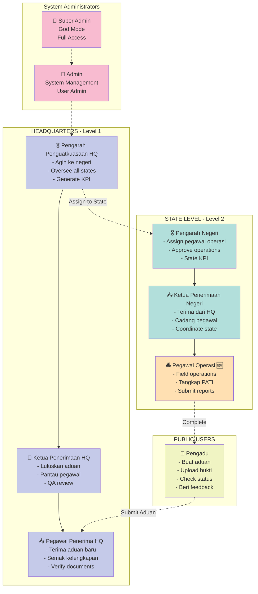

---

## 3. STATE TRANSITION DIAGRAM

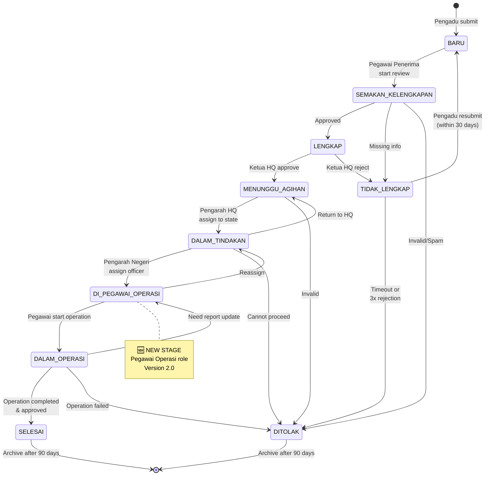

---

## 4. SEQUENCE DIAGRAM - User Journey

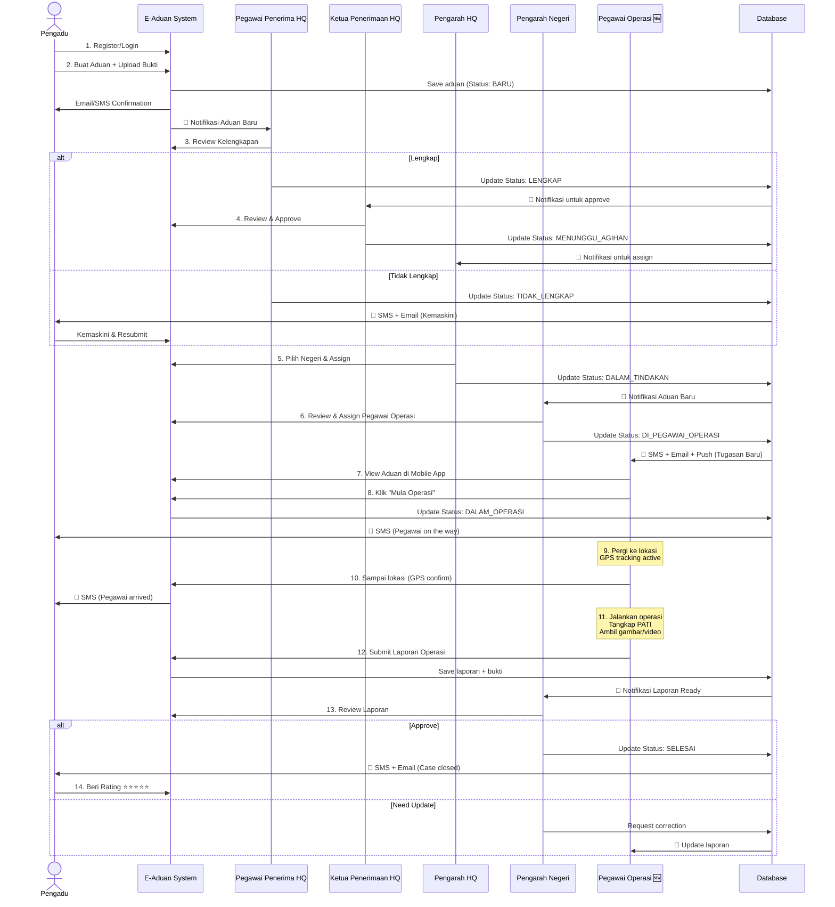

---

## 5. TIMELINE GANTT CHART

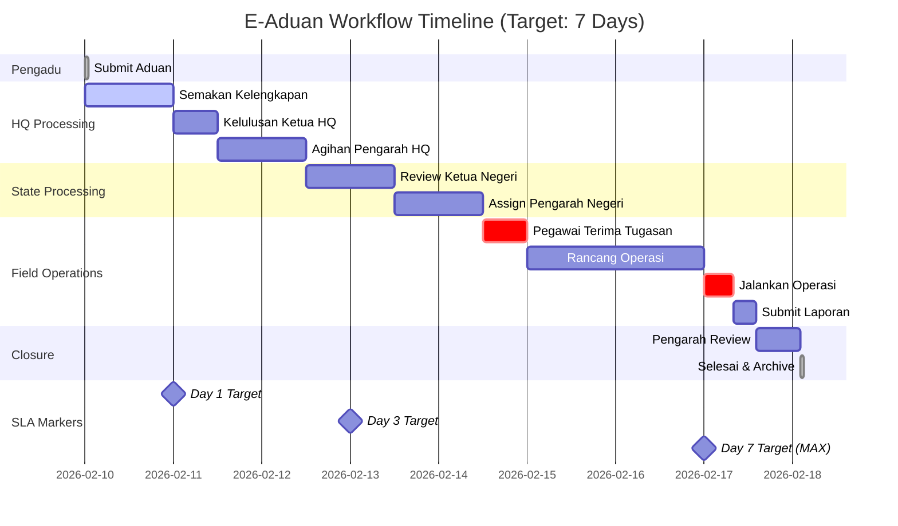

---

## 6. GEOGRAPHY - 16 States Coverage

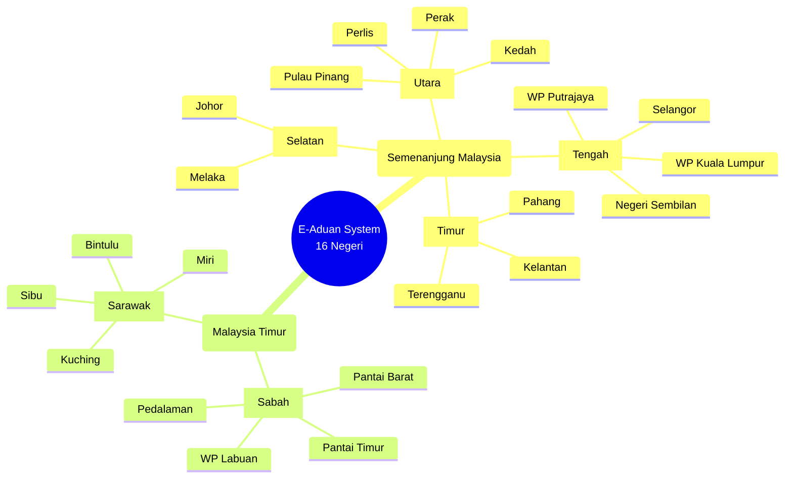

---

## 7. PERMISSION MATRIX - Access Control

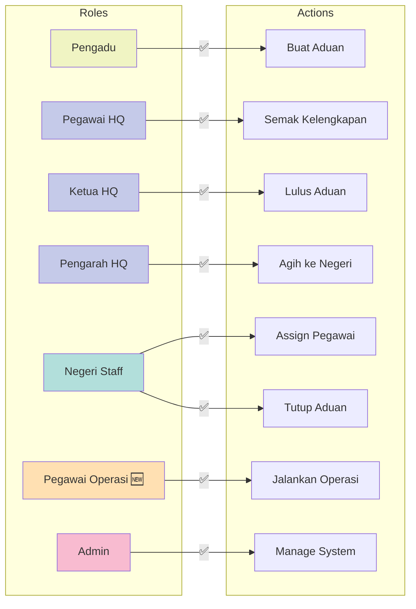

---

## 8. DATA FLOW DIAGRAM

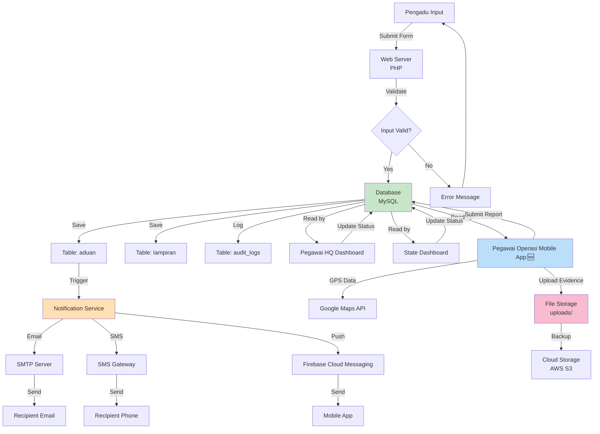

---

## 9. KPI DASHBOARD - Metrics Overview

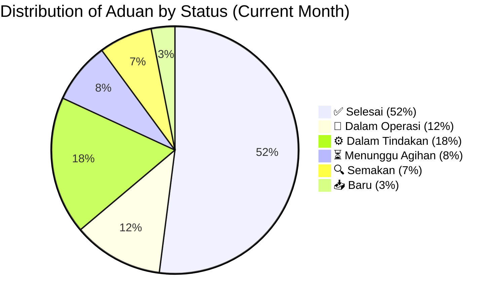

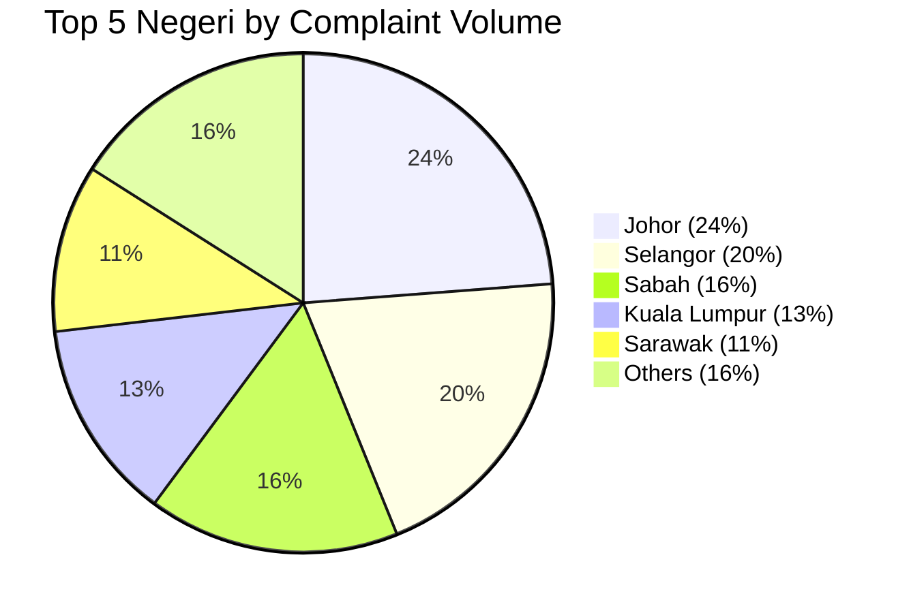

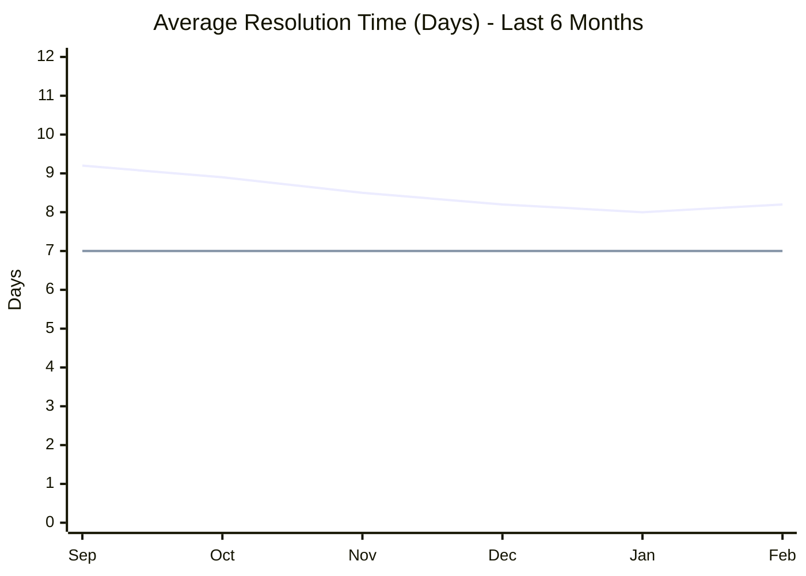

---

## 10. OPERATION SCENARIOS - Field Work

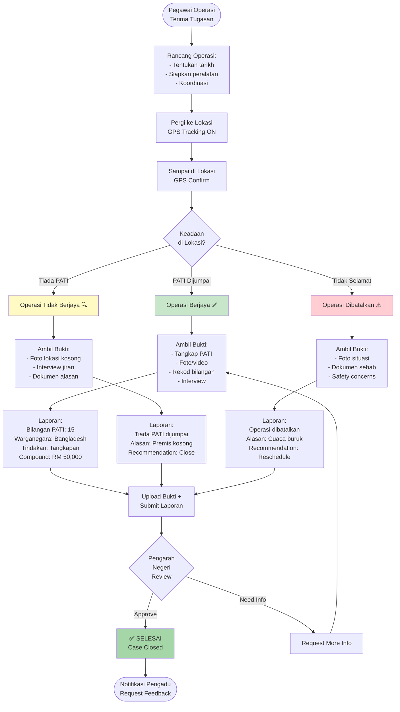

---

## 11. NOTIFICATION FLOW

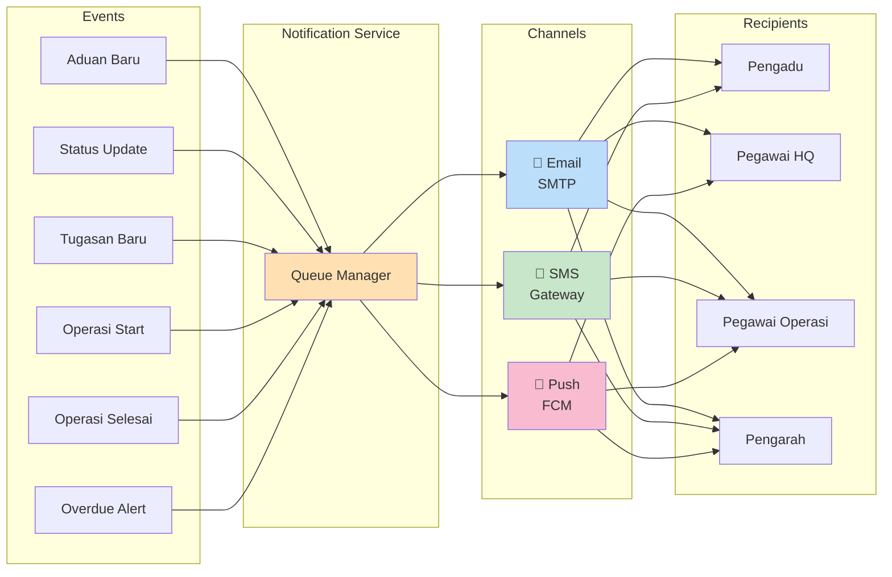

---

## 12. DATABASE ER DIAGRAM (Simplified)

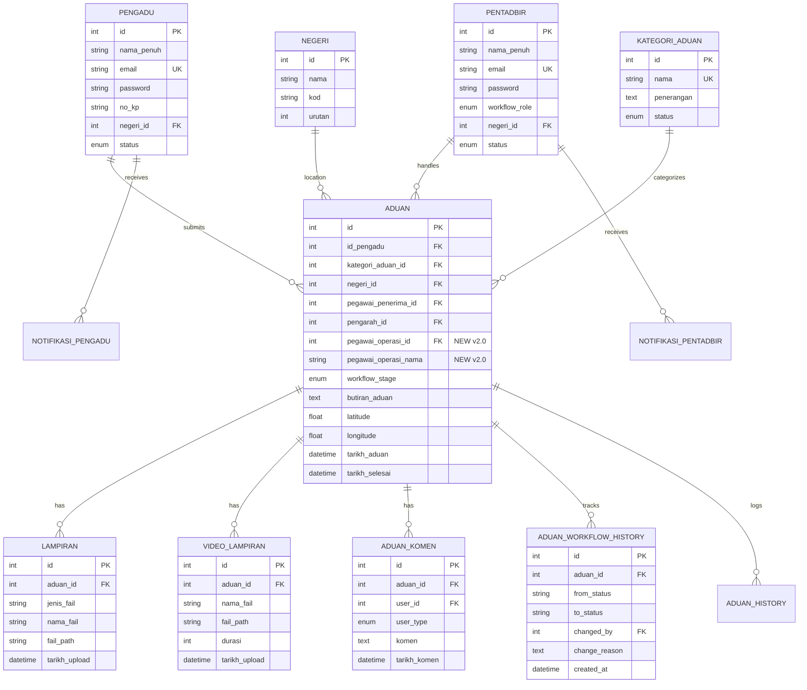

---

## HOW TO USE THESE DIAGRAMS

### In Markdown Files:
Simply copy the code blocks (including the triple backticks with `mermaid`) into any Markdown file.

### In GitHub:
GitHub automatically renders Mermaid diagrams in `.md` files. Just push the file and view it.

### In VS Code:
Install extension: **Mermaid Preview** or **Markdown Preview Mermaid Support**

### Online Viewer:
1. Visit: https://mermaid.live/
2. Paste the code
3. View live preview
4. Export as PNG/SVG

### In Documentation Sites:
Most modern documentation platforms (GitBook, Docusaurus, MkDocs) support Mermaid natively.

---

## DIAGRAM LEGEND

### Flowchart Symbols:
- `[ ]` = Process/Action
- `{ }` = Decision point
- `(( ))` = Start/End
- `-->` = Flow direction
- `-.->` = Dotted connection

### Colors:
- **Green** = Success/Completed states
- **Blue** = In-progress states
- **Yellow** = Pending/Warning states
- **Red** = Rejected/Failed states
- **Orange** = Special attention (Pegawai Operasi)
- **Pink** = Admin/System level

### Icons (in text):
- 📥 = Inbox/Received
- ✅ = Approved/Completed
- ❌ = Rejected
- ⏳ = Pending
- ⚙️ = Processing
- 🚔 = Police/Operations
- 🚨 = Active operation
- 🚫 = Blocked
- 🔔 = Notification
- 📱 = SMS
- 📧 = Email
- 🆕 = New feature (v2.0)

---

**Document Version:** 2.0  
**Created:** 16 February 2026  
**For:** Jabatan Imigresen Malaysia  
**Classification:** Internal Use - Documentation  

For complete workflow details, see: `WORKFLOW_LENGKAP.md`
